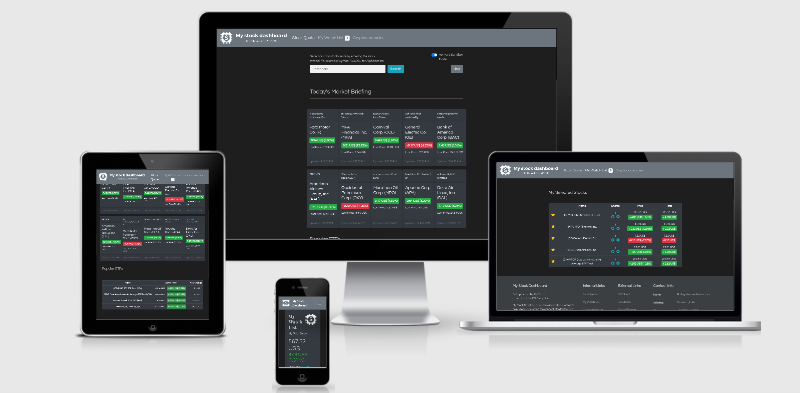

# My Stock Dashboard

Welcome, 

This project was carried out within the framework of my Second Milestone Project for the Full-Stack Web Development Diploma from the Code Institute.  

Used technologies include  HTML5, CSS3, JavaScript to demonstrate my personal skills and acquired knowledge from this online program. 

Code was written mostly on my own but some libraries were taken as well to improve functionality and CSS. 

I will be glad to hear your feedback about your experience using this web application. Just fill out the contact form included in the application when you click on "Contact Us"

Website hosted on GitHub Pages here: [My Stock Dashboard](https://bramrodrigo89.github.io/second-milestone-project/)

## UX

The main objective was to create a simple looking and appealing online dashboard for following market stock prices, ETFs and Cryptocurrencies, inquiring about different public companies’ information and their latest related news on the market prices. 
 
The intention is to target new users who do not have much experience in watching stock prices so they can understand the concepts and focus on the most important variables of basic stock watching. The dashboard should allow them to create a personal Watch List and a simple portfolio simulation to calculate how much they would gain or lose in the case of possessing actual shares of the selected stocks. 
 
The dashboard should be in the form of a web-based application that can be accessed from different mobile devices or desktop computers. At the moment, the web application should rely solely on the browser’s local storage to save information on selected stocks und shares’ units, in order to avoid saving the user’s personal information by asking users to register. 
 
This importance for this web application was identified through some User Stories like the following:
 
- "I never had so much experience in watching market stocks. I always felt interested in trying to understand how that works, but whenever I go on sites like Yahoo! Finance or MarketWatch.com I just feel overwhelmed by so many numbers and graphs that I stop trying."
 
- "As a user with some kind of experience in market stocks, I would like to find a web app to create my own  Watch List with as many stocks and ETFs as I want without having to create an account or subscribe to an expensive financial advice service. Those sites normally offer  Watch Lists that are limited to 5 or 10 stocks. I would like to have many more!"
 
- "I am just starting to watch a few market stocks on my own but I know only the most famous companies like Google or Amazon. I would like to have a web application to discover which are the most active stocks on the market every day and read what the companies do or what’s in the news about them. Only then I could consider buying some shares from them."

The website was first designed using a wireframe which can be found on miro.com under this link:

[Miro Wireframe - Second Milestone Project](https://miro.com/app/board/o9J_kvJ0tW8=/)

## Features

My Stock Dashboard (MSD) is composed by tree main pages among which customers can navigate to find the information they need: get a stock quote, check the personal Watch List or check the latest prices on Cryptocurrencies (this last feature is not yet deployed). 
 
### Existing Features
- Stock Quote - MSD allows users to search for any stock listed on the public market by entering the stock symbol in the search bar and get the latest quote. 
- Autocomplete Menu - when the user is not sure about the stock symbol, MSD can do a GET HTTP request to the API server to obtain a list of matching suggestions when the company name is entered in the search bar. 
- Stock Chart - MSD displays a line chart of the price quote history. The time windows of 1 day, 5 days, 1 month, 1 year and “max” can be selected using the buttons above. 
- Stock Quote Table - containing the most important variables and numbers. 
- Company Profile Information - contains a description of the inquired company, their contact information and their industry sector that they belong to. 
- Today’s Market Briefing - MSD displays the most active stocks listed on the market today. Cards are interactive and can be clicked to get more information on that market quote. 
- Popular ETFs - As an alternative to displaying Market Indexes, these popular ETFs mimic these indices, such as SPY for the S&P 500, DIA for Dow Jones, and IWM for Russell 2000. 
- My Watch List - After selecting the stocks of the user’s preference, a Watch List is created that summarizes the daily total gains or losses and the average performance of the selected stocks. The user can easily remove a stock from the WatchList by clicking on the star icon or adding more or fewer share units for a specific stock. The data displayed is updated automatically with every action. 

In addition, these are the plans for additional features to be implemented in the future:

### Features Left to Implement
- Cryptocurrencies Watch Dashboard
- Back-End Development

## Technologies Used

Languages, frameworks, libraries used to construct this project:

- HTML5
- CSS3
- JavaScript
- [Bootstrap](https://getbootstrap.com/docs/4.4/getting-started/introduction/)
    - The project uses **Bootstrap** to simplify giving styles and adding JavaScripts to different elements. Also it is found in the navbar construct, its grid-layout system was used, as well as other elements like modals and carrousels to complement the webiste. 
- [Google Map JavaScript API](https://developers.google.com/maps/documentation/javascript/tutorial)
    - The property map was created using **Google Maps** and some markers were added. Personal API Key used. 
- [ISO Country List - HTML select/dropdown snippet](https://www.freeformatter.com/iso-country-list-html-select.html)
    - Country list was taken from this library to implement in the reservation form.
- [Font Awesome Icon Library](https://fontawesome.com/icons?d=gallery)
    - Icons were imported to provide some visual iconography to information. 
- [Google Font Library](https://fonts.google.com/)
    - Imported two different fonts, Open-Sans and Montserrat for texts. 
- [Am I Responsive](http://ami.responsivedesign.is)
    - Testing responsiveness of the website

## Testing

Front-End Software was tested in real phones opening the webiste in a personal Pixel 2 to check the appearence in real life. 

Testing of Back-End will be peformed when the back-end software is developed. 

## Deployment

This project is available at the moment on GitHub pages only:

[My Stock Dashboard](https://bramrodrigo89.github.io/second-milestone-project/)

## Credits

### Content
- Text at the moment is generic in most sections, but will be replaced by real information from the company. 

### Media
- The photos used in this site were all taken by myself and I have full ownership on them. 

### Acknowledgements

- I received inspiration for this project from my family. 
- Special thanks to my mentor from Code Institute for the direction I needed:
- Anthony Ngene     @tonymontaro_mentor
- And last but not least, many thanks to the Tutor Team from Code Institute for helping me whenever I needed help the most. 
